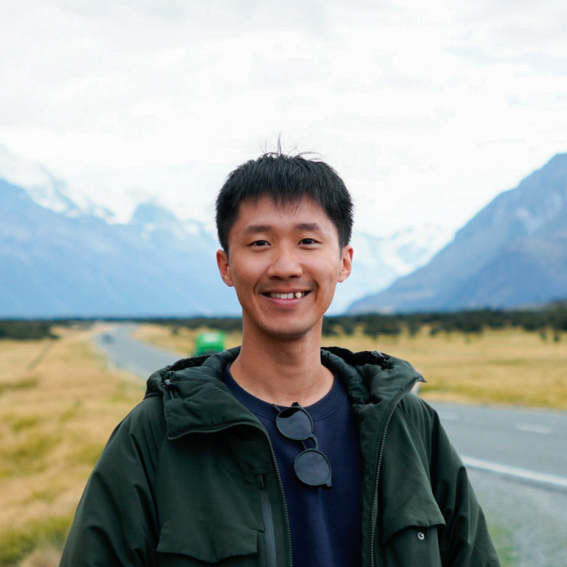
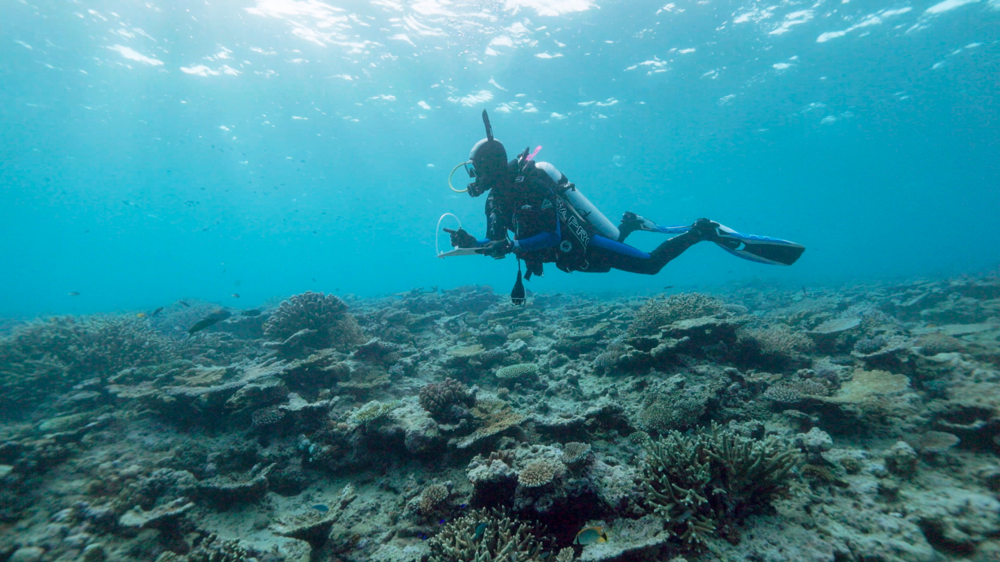

## About Me

::::: grid
::: {.g-col-12 .g-col-md-5}
{width="100%" style="border-radius: 8px;"}
:::

::: {.g-col-12 .g-col-md-7}
I am a marine ecologist who recently completed my PhD at the University of Sydney (passed defense with no corrections; degree conferral November 2026). My research focuses on fish behaviuor, ecological interactions, and ecosystem function across coral reefs and marine habitats. I integrate fish surveys (visual census, stereo-RUVs, and eDNA), benthic photogrammetry, and organismal trait assays (lipids, fatty acids, and stable isotopes) to investigate functional dynamics across spatial scales. I am actively seeking postdoctoral, academic, and research-intensive opportunities. Feel free to reach out directly at [tony.tsaihsuan.hsu\@gmail.com](mailto:tony.tsaihsuan.hsu@gmail.com).
:::
:::::

## Some Fun Photos

### *Chaetodon rainfordi* (Rainford's butterflyfish) is such a fascinating species to center a PhD around!

### Conducting fish visual census on the southern GBR, Australia

### Photogrammetry-mapping at One Tree Island, southern GBR, Australia

