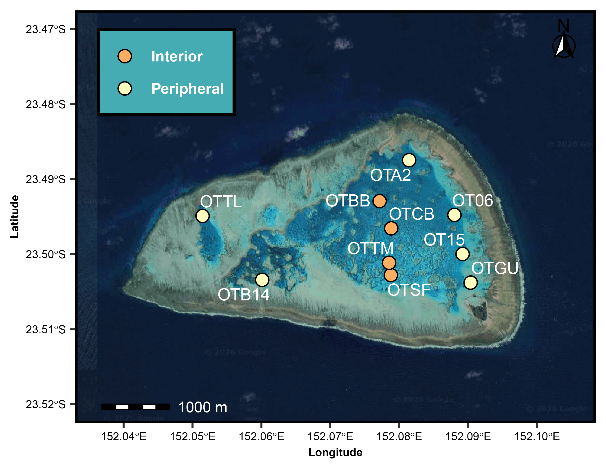
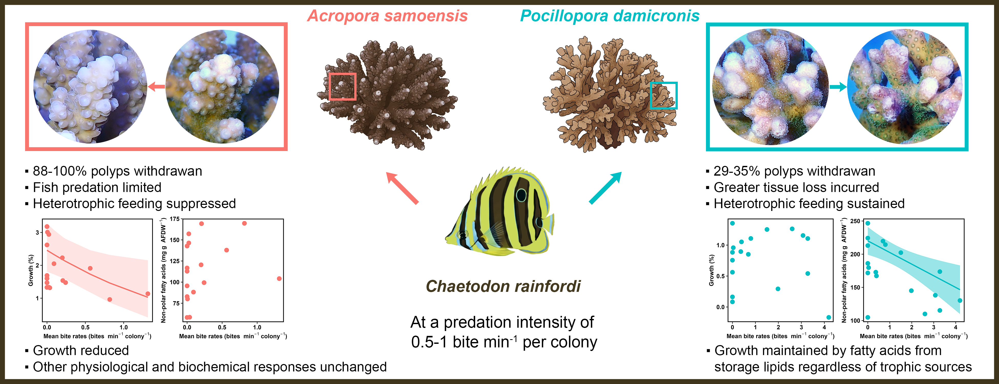
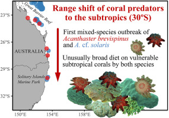
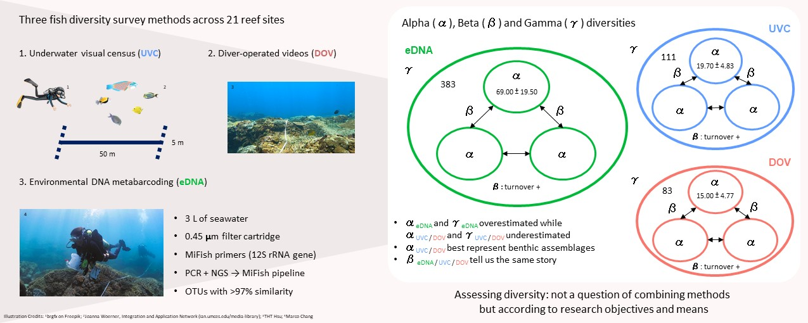
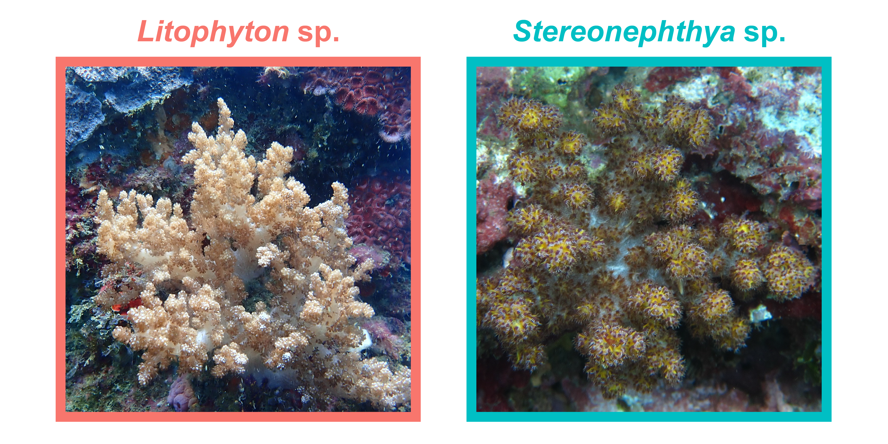

At heart, I am a **fish ecologist** with a strong foundation in coral physiology and benthic ecology. My work sits at the intersection of fish behaviour, community dynamics, and reef function, exploring how mobile organisms interact with structural benthic habitats and how these dynamics shift across environmental gradients.

To address complex ecological questions, I integrate diverse methodologies including field visual census, video-based behavioural analysis (RUVs/stereo-RUVs), environmental DNA (eDNA) metabarcoding, photogrammetry, and laboratory physiological assays (lipids, fatty acids, stable isotopes, and organismal traits).

My research portfolio is structured around three interconnected themes:

1.  **Corallivory & Predation Dynamics**

2.  **Marine Biodiversity & Survey Methodology**

3.  **Coral Ecophysiology & Organismal Traits**

## 1. Corallivory & Predation Dynamics

This research focus moves beyond static community metrics to quantify dynamic ecological processes, investigating the drivers of fish feeding behaviour and the downstream biological consequences for host corals.

### 1.1. Drivers of Fish Corallivory

Applying optimised video sampling developed in our methodology work ([Hsu et al., 2025](https://doi.org/10.1007/s00338-024-02613-6)), this project investigated ecological drivers of fish corallivory across coral reefs and within a reef lagoon in northeast Australia. This is achieved through a combination of ecological field surveys on fish and benthic communities, intense behavioural observations, and photogrammetry-based 3D mapping.

- **Broad Scale:** Total bite rates (bites per 30 min) of obligate corallivorous fishes were directly and positively influenced by species richness and feeding behaviour (duration and intensity). Predation risk and structural complexity showed no significant direct or indirect negative effects. {fig-align="center" width="75%"}

- **Lagoon Scale:** Going beyond bite rates, daily coral consumption by obligate corallivorous butterflyfish assemblages was estimated using stereo-RUVs. Species richness remained the strongest positive driver of coral consumption. Reef complexity exhibited scale-dependent effects, indirectly mediated by feeding duration, suggesting fine-scale complexity creates safer foraging grounds that facilitate longer feeding bouts and greater coral consumption. {fig-align="center" width="75%"}

- **Keywords:** Ecological function, Feeding behaviour, Coral removal rates, Coral predation, Chaetodontidae, Reef structural complexity, Indirect effects.

- **Publications & Manuscripts:**

  - **Hsu, T.-H. T.**, et al. (2026). Corallivore assemblage, feeding behaviour, and cover of *Acropora* corals drive fish corallivory on tropical reefs. *Ecosphere*.
  - **Hsu, T.-H. T.**, et al. (In Review). Understanding the drivers of coral consumption rates by butterflyfishes in a lagoonal reef system.

### 1.2 Effects of Butterflyfish Predation on Corals

This project assessed the biological consequences of butterflyfish predation on coral hosts through a 17-day aquarium experiment. Two scleractinian coral species (*Acropora samoensis* and *Pocillopora damicornis*) were exposed to varying levels of predation by the polyp-feeding butterflyfish, *Chaetodon rainfordi*.

Predation elicited species-specific sub-lethal responses:

- ***Acropora samoensis*****:** Minimised predation risk via polyp withdrawal and likely suppressed heterotrophy, resulting in reduced growth.

- ***Pocillopora damicornis*****:** Kept most polyps extended to sustain heterotrophy, maintaining growth likely through mobilising fatty acids from storage lipids of both heterotrophic and autotrophic sources.

These short-term sub-lethal impacts could elevate coral susceptibility to environmental stress. {width="100%" fig-align="center"}

- **Keywords:** Fish corallivory, Coral browser, Energy trade-offs, Trophic strategy, Buoyant weight, Fatty acid profile, Gas chromatography–mass spectrometry.

- **Publication:**

  - **Hsu, T.-H. T.**, et al. (2026). Behavioural, physiological, and biochemical responses of two species of scleractinian coral to butterflyfish predation. [*Marine Environmental Research*](https://doi.org/10.1016/j.marenvres.2026.108026).

### 1.3 Subtropical Coral Predation & COTS Range Shifts

- **Overview:** Documented the first mixed-species outbreak and coral predation by Crown-of-Thorns Starfish (*Acanthaster brevispinus* and *A. cf. solaris*) on subtropical reefs to inform management of climate-driven range shifts.

{width="60%" fig-align="center"}

- **Keywords:** *Acanthaster*, Corallivory, Range shifts, Subtropical reef management.

- **Publication:**

  - Sommer, B., Malcolm, H. A., Cooney, C., Dalton, S. J., Foo, S. A., Fraser, N., **Hsu, T.-H. T.**, Maguire, D., Nimbs, M. J., Strehling, N., Webb, M., & Byrne, M. (2025). Understanding and managing species range shifts: first observed mixed-species outbreak and coral predation by crown-of-thorns starfish (*Acanthaster brevispinus* and *A. cf. solaris*) on subtropical reefs. [*Marine Environmental Research*](https://doi.org/10.1016/j.marenvres.2025.107556)

## 2. Marine Biodiversity & Survey Methodology

### 2.1 Fish Survey Method Optimisation

Optimal sampling strategies were developed to quantify the relative abundance, species richness, and bite rates of reef fish from Remote Underwater Video (RUV) deployments. This methodological advancement reduces analysis time while minimising sampling errors, establishing the necessary foundation to quantify bite rates and rates of corallivory at an assemblage level.

- **Keywords:** RUV survey design, sampling efficiency, behavioural quantification.
- **Publication:**
  - **Hsu, T.-H. T.**, et al. (2025). Optimizing remote underwater video sampling to quantify relative abundance, richness, and corallivory rates of reef fish. [*Coral Reefs*](https://doi.org/10.1007/s00338-024-02613-6).

### 2.2 Fish Diversity Across Scales: eDNA vs. Visual Surveys

This project evaluated the efficacy and spatial resolution of Environmental DNA (eDNA) metabarcoding against traditional visual methods, Underwater Visual Census (UVC) and Diver-Operated Video (DOV), across 21 reef sites in northern Taiwan.

- $\gamma$-diversity (Regional Pool): eDNA detected 438 marine fish species, demonstrating unmatched regional detection power compared to visual techniques when adequately replicated.

- $\beta$-diversity (Spatial Patterns): All methods captured consistent community assemblage patterns and a clear distance-decay relationship in similarity.

- $\alpha$-diversity (Local Richness): Visual surveys (UVC/DOV) proved superior for examining micro-habitat and benthic interactions, though no single method captured the complete local fauna.

- **Key Takeaway:** Survey methodologies should be selected based on specific ecological questions and target spatial scales rather than defaulted to combination approaches. {width="100%" fig-align="center"}

- **Keywords:** Metabarcoding,12S rRNA, Ichthyofauna, Spatial turnover, Benthos, Taiwan.

- **Publication:**

  - **Hsu, T.-H. T.**, et al. (2023). Navigating the scales of diversity in subtropical and coastal fish assemblages ascertained by eDNA and visual surveys. [*Ecological Indicators*](https://doi.org/10.1016/j.ecolind.2023.110044).

## 3. Coral Ecophysiology & Organismal Traits

This research theme investigates how hard and soft corals adjust their physiological strategies, trait variability, and algal symbioses (*Symbiodiniaceae*) to thrive across diverse and marginal marine environments.

### 3.1 Energy Acquisition & Intraspecific Trait Variability in Scleractinians

Examined how scleractinian corals allocate energy resources across intraspecific gradients, highlighting how plastic trait responses dictate coral performance and resilience under dynamic environmental conditions.

- **Keywords:** Anthozoan, Physiological ecology, Variance, Physiological niches, Environmental filtering, Adaptive strategies.
- **Publication:**
  - De Palmas, S., Chen, Q., Guerbet, A., Hsieh, Y. E., **Hsu, T.-H. T.**, Lin, Y. V., Sturaro, N., Wang, P.-L., & Denis, V. (2025). Energy acquisition and allocation strategies in scleractinian corals: insights from intraspecific trait variability. [*Coral Reefs*](https://doi.org/10.1007/s00338-025-02617-w)

### 3.2 High-Latitude Octocoral Traits & Singular *Symbiodiniaceae* Associations

Investigated the organismal traits and unique algal symbiont associations of two octocoral species inhabiting a high-latitude, marginal coral community in northern Taiwan. {width="100%" fig-align="center"}

- **Keywords:** Stable isotope, Intraspecific variation, Trade-off, Plasticity, Functionality, Algal symbiont, Trait-based approach, Soft corals.

- **Publication:**

  - **Hsu, T.-H. T.**, Carlu, L., Hsieh, Y. E., Lai, T.-Y. A., Wang, C.-W., Huang, C.-Y., Yang, S.-H., Wang, P.-L., Sturaro, N., & Denis, V. (2020). Stranger things: organismal traits of two octocorals associated with singular Symbiodiniaceae in a high-latitude coral community from northern Taiwan. [*Frontiers in Marine Science*](https://doi.org/10.3389/fmars.2020.606601)*.*

## 4. Lists of Publications

### Journal article

#### Published

- **Hsu, T.-H. T.**, Hoey, A. S., Ferrari, R., Toor, M., Gordon, S., Remmers, T., Smallhorn-West, J., Piccaluga, A., & Figueira, W. F. (in press). Corallivore assemblage, feeding behaviour, and cover of *Acropora* corals drive fish corallivory on tropical reefs. *Ecosphere*

- **Hsu, T.-H. T.**, Hoey, A. S., Warren, C. R., Marrable, I., & Figueira, W. F. (2026). Behavioural, physiological, and biochemical responses of two species of scleractinian coral to butterflyfish predation. *Mar Environ Res*, 218, 108026. <https://doi.org/10.1016/j.marenvres.2026.108026>

- **Hsu, T.-H. T.**, Gordon, S., Ferrari, R., Hoey, A. S., & Figueira, W. F. (2025). Optimizing remote underwater video sampling to quantify relative abundance, richness, and corallivory rates of reef fish. *Coral Reefs*, *44*(2), 435-449. <https://doi.org/10.1007/s00338-024-02613-6>

- Sommer, B., Malcolm, H. A., Cooney, C., Dalton, S. J., Foo, S. A., Fraser, N., **Hsu, T.-H. T.**, Maguire, D., Nimbs, M. J., Strehling, N., Webb, M., & Byrne, M. (2025). Understanding and managing species range shifts: first observed mixed-species outbreak and coral predation by crown-of-thorns starfish (*Acanthaster brevispinus* and *A.* cf. *solaris*) on subtropical reefs. *Mar Environ Res*, *212*, 107556. <https://doi.org/10.1016/j.marenvres.2025.107556>

- De Palmas, S., Chen, Q., Guerbet, A., Hsieh, Y. E., **Hsu, T.-H. T.**, Lin, Y. V., Sturaro, N., Wang, P.-L., & Denis, V. (2025). Energy acquisition and allocation strategies in scleractinian corals: insights from intraspecific trait variability. *Coral Reefs*, *44*(2), 489-500. <https://doi.org/10.1007/s00338-025-02617-w>

- **Hsu, T.-H. T.**, Chen, W.-J., & Denis, V. (2023). Navigating the scales of diversity in subtropical and coastal fish assemblages ascertained by eDNA and visual surveys. *Ecological Indicators*, *148*, 110044. <https://doi.org/10.1016/j.ecolind.2023.110044>

- **Hsu, T.-H. T.**, Carlu, L., Hsieh, Y. E., Lai, T.-Y. A., Wang, C.-W., Huang, C.-Y., Yang, S.-H., Wang, P.-L., Sturaro, N., & Denis, V. (2020). Stranger things: organismal traits of two octocorals associated with singular Symbiodiniaceae in a high-latitude coral community from northern Taiwan. *Frontiers in Marine Science*, *7*(1158). <https://doi.org/10.3389/fmars.2020.606601>

#### Under review

- **Hsu, T.-H. T.**, Hoey, A. S., Clark, G. F., Ferrari, R., Fournet, C., Marrable, I., Piccaluga, A., Turnbull, J. W., Wilson, B., & Figueira, W. F. (in review). Understanding the drivers of coral consumption rates by butterflyfishes in a lagoonal reef system.

- Marrable, I., Piccaluga, A., **Hsu, T.-H. T.**, Turnbull, J., Warren, C., Marzinelli, E. M., Ortiz, J.-C., & Figueira, W. F. (in review). Dietary specialisation modulates vulnerability of butterflyfishes to disturbance events.

### Data

- **Hsu, T.-H. T.**, Hoey, A. S., Warren, C. R., Marrable, I., & Figueira, W. F. (2026). *Data from "Behavioural, physiological, and biochemical responses of two species of scleractinian coral to butterflyfish predation."* \[Dataset\]. Sydney eScholarship. <https://doi.org/10.25910/x6q7-mk41>

- **Hsu, T.-H. T.**, Hoey, A. S., Ferrari, R., Toor, M., Gordon, S., Remmers, T., Smallhorn-West, J., Piccaluga, A., & Figueira, W. F. (2026). *Data from "Corallivore assemblage, feeding behavior, and cover of Acropora corals drive fish corallivory on tropical reefs"* \[Dataset\]. <https://doi.org/10.25910/hevd-0g28>

- **Hsu, T.-H. T.**, Gordon, S., Ferrari, R., Hoey, A. S., & Figueira, W. F. (2025). *Data and R markdown to replicate analyses in “Optimizing remote underwater video sampling to quantify relative abundance, richness, and corallivory rates of reef fish”* \[Dataset\]. Sydney eScholarship. <https://doi.org/10.25910/agvq-3f82>

- **Hsu, T.-H. T.**, Chen, W.-J., & Denis, V. (2023). *Data from: Navigating the scales of diversity in subtropical and coastal fish assemblages ascertained by eDNA and visual surveys* \[Dataset\]. Dryad. <https://doi.org/10.5061/dryad.3xsj3txk4>

- **Hsu, T.-H. T.**, Carlu, L., Hsieh, Y. E., Lai, T.-Y. A., Wang, C.-W., Huang, C.-Y., Yang, S.-H., Wang, P.-L., Sturaro, N., & Denis, V. (2020). *Data from Stranger Things: Organismal traits of two octocorals associated with singular Symbiodiniaceae in a high-latitude coral community from northern Taiwan* \[Dataset\]. Dryad. <https://doi.org/10.5061/dryad.qz612jmd7>
